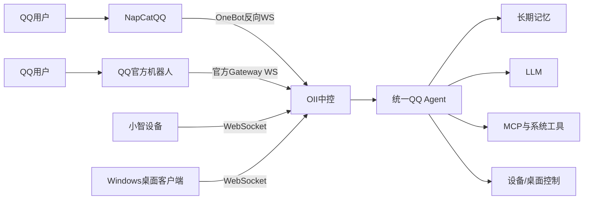

# OII 中控

本项目是小智中控服务，统一提供 QQ 对话、长期记忆、MCP、设备控制和桌面控制能力。

## 功能概览

- 多入口对话：小智语音设备、NapCatQQ、QQ 官方机器人。
- 统一 Agent：不同入口共享模型、会话、长期记忆、MCP 和系统工具。
- QQ 能力：私聊接收、自动回复、消息发送和备用账号接入。
- 设备能力：通过 MCP 控制在线小智设备和家电。
- 桌面能力：通过 Windows 客户端打开应用、浏览器、路径，关闭程序和执行关机操作。
- MCP 能力：支持 WebSocket MCP 服务和 MCP 聚合器，可扩展天气、新闻、路线、餐厅等工具。
- 长期记忆：支持服务端记忆后端，并支持 QQ / ESP 用户身份映射。
- 辅助服务：OTA、视觉分析、短信验证码和邮件验证码通知。
未来还可能加入灯舵机，投影等高级控件
## 架构



QQ 入口只负责平台协议适配，业务处理统一进入 `QQAgent` 和公共 Agent Pipeline。这样 NapCat 和 QQ 官方机器人可以作为两个独立入口，共用相同的记忆、MCP 和功能。
私人项目 部署的时候自己调成公共  比如memory系统的id  或者esp控件的mac  都是用于私人 做人物
## 启动

```bash
./set-and-start.sh
```

服务器运行前会读取：

```text
data/.config.yaml
```

该文件包含本机密钥和部署配置，不提交到 Git。

## QQ 接入

### NapCat / OneBot

NapCat 连接中控的反向 WebSocket：

```text
ws://服务器地址:8082/onebot
```

中控接收 OneBot 事件，并通过 NapCat HTTP API 发送消息：

```text
http://127.0.0.1:3000
```

配置示例：

```yaml
qq:
  enabled: true
  onebot_ws_host: 0.0.0.0
  onebot_ws_port: 8082
  onebot_ws_path: /onebot
  onebot_ws_token: "设置一个安全Token"
  napcat_http_url: http://127.0.0.1:3000
  napcat_http_token: "NapCat API Token"
  owner_qq: "你的QQ号"
```

### QQ 官方机器人

中控可以直接连接 QQ 官方机器人 Gateway，不需要 AstrBot，也不需要 NapCat：

```text
中控 → QQ 官方 Gateway WebSocket：接收事件
中控 → QQ 官方 OpenAPI：发送回复
```

配置示例：

```yaml
qq_official:
  enabled: true
  app_id: "QQ开放平台AppID"
  app_secret: "QQ开放平台AppSecret"
  memory_identity: "你的NapCat QQ号"
  intents: 33554432
```

`memory_identity` 用于让 QQ 官方机器人和 NapCat 共用同一个记忆会话。建议把 AppSecret 放入环境变量：

```bash
export QQ_OFFICIAL_APP_ID="你的AppID"
export QQ_OFFICIAL_APP_SECRET="你的AppSecret"
```

QQ 官方机器人需要在 QQ 开放平台开启消息列表单聊权限。官方机器人返回的是用户 `openid`，中控通过 `memory_identity` 将其映射到统一记忆身份。

## 端口

| 端口 | 用途 |
| --- | --- |
| 8000 | 小智设备 WebSocket |
| 8005 | OTA、HTTP 接口、桌面控制 WebSocket |
| 8082 | NapCat OneBot 反向 WebSocket |
| 3000 | NapCat 本地 HTTP API，由 NapCat 提供 |

桌面控制地址：

```text
ws://服务器地址:8005/api/desktop
```

桌面控制客户端需要使用服务器 `server.desktop_token` 作为 Token。客户端本地配置通常位于：

```text
C:\Users\你的用户名\AppData\Local\XiaozhiDesktopControl\config.json
```

## 更新

```bash
git pull origin main
./set-and-start.sh
```

不要把 `data/.config.yaml`、AppSecret、API Key、邮箱授权码或其他 Token 提交到 Git。

## 项目定位

### Cognitive Core（可配置认知主路径）

仓库现已包含独立的 `cognitive_core/` 和 Controller-side `controller/`。启用 `config.yaml`/`data/.config.yaml` 的 `cognitive_core.enabled` 后，QQ/NapCat 消息和 ESP32 ASR 文本通过统一 `CognitiveEvent` 进入 Event Router；Core 只生成 `Action`，持久化到 Action Outbox，由 Controller Dispatcher 执行 QQ、ESP32 或 MCP 动作，结果再以 `action_result` Event 回流。关闭开关时保留旧 Agent Pipeline。

独立 Core 可用以下命令运行：

```powershell
$env:COGNITIVE_MEMORY_BACKEND="local"
python -m cognitive_core.main
```

生产配置支持 `TENCENT_MEMORY_URL`/`TENCENT_MEMORY_API_KEY` 环境变量覆盖，也会读取现有 `data/.config.yaml` 的 `tencent_memory_*` scope。Memory 不可用时使用明确的本地 fallback。API 默认端口 8010，`/events`、`/state`、`/heartbeat/run-once` 受 `COGNITIVE_CORE_API_TOKEN` 保护（未设置 token 时为本地开发兼容模式）。

当前真实接入与验证状态见：`docs/final-architecture.md`、`docs/integration-guide.md`、`docs/testing-report.md`。

OII 是一个个人智能中控，不是单一聊天机器人。它把消息入口、设备、记忆和工具统一到一个 Agent 中，使用户可以从不同终端访问相同的能力。

典型使用场景：

- 在 QQ 中查询天气、新闻、农历和路线；
- 通过 QQ 控制家中的小智设备或空调；
- 通过 QQ 让 Windows 电脑打开应用；
- 通过语音设备继续同一用户的对话；
- 使用邮件和短信通知将验证码发送到 QQ；
- 让 NapCat 和 QQ 官方机器人作为两个独立的备用入口。


QQ 适配器只负责接收和发送消息；真正的对话、记忆、工具调用由 `QQAgent` 和公共 Pipeline 处理。新增消息平台时，可以复用已有业务能力。

### 本地优先配置

默认配置用于说明字段和启动方式，实际部署配置放在 `data/.config.yaml`。密钥、用户白名单和本机地址不会写入公共配置模板。

## 部署检查清单

部署前确认：

- Python 虚拟环境已创建并激活；
- `requirements.txt` 依赖安装完成；
- `data/.config.yaml` 已配置模型和服务地址；
- MemoryCore 和 MCP 服务可以正常启动；
- QQ 官方机器人已开启所需消息权限；
- NapCat 使用的反向 WS Token 与中控一致；
- Windows 桌面客户端使用的 Token 与 `server.desktop_token` 一致；
- 防火墙只开放实际需要的端口。

启动后重点检查：

```text
Memory system ready
MCP接入点连接成功
QQ Agent shared Tool/MCP pipeline initialized
```

如果使用 NapCat，还应看到：

```text
OneBot Gateway listening on 0.0.0.0:8082
NapCat OneBot connected
```

如果使用 QQ 官方机器人，应看到官方 Gateway 连接成功相关日志。

## 版本更新

```bash
git pull origin main
source venv/bin/activate
pip install -r requirements.txt
./set-and-start.sh
